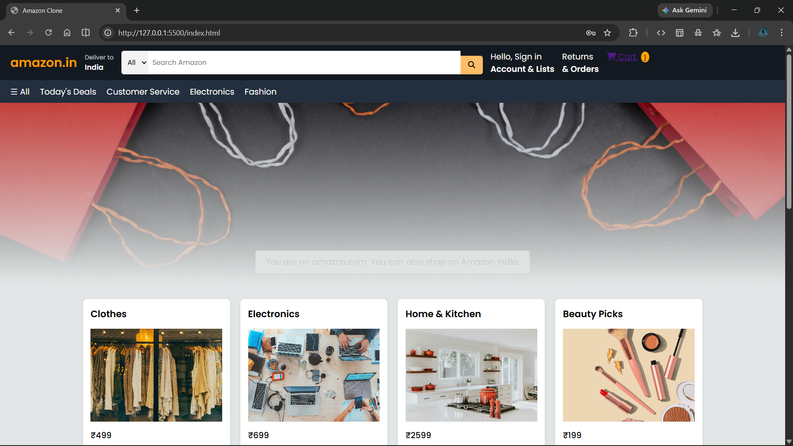
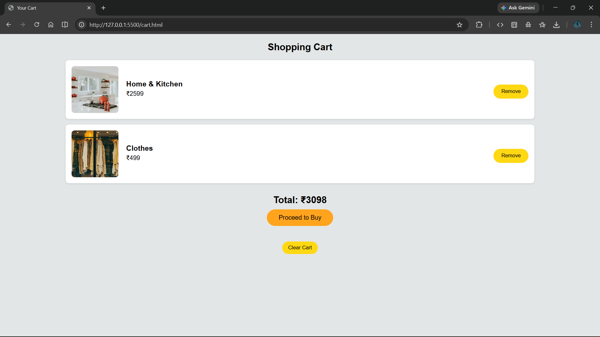
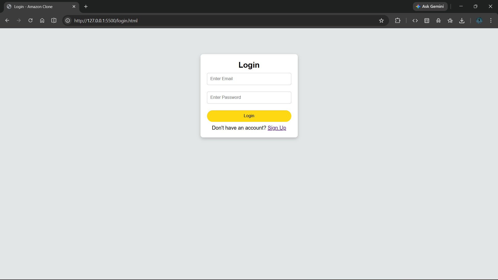

# 🛒 Amazon Clone (Frontend Project)

This is a fully responsive Amazon Clone built using **HTML, CSS, and JavaScript**.
The project simulates a real e-commerce website with cart functionality, login/signup system, and multiple pages.

---

## 🌐 Live Website

https://yashsb-07.github.io/amazon_clone/

## 🚀 Features

* Amazon-style Homepage UI
* Product Listing
* Add to Cart
* Cart Counter
* Cart Page
* Remove from Cart
* Total Price Calculation
* Login System (LocalStorage)
* Signup System (LocalStorage)
* Responsive Design
* Multi-page Website

---

## 🛠️ Technologies Used

* HTML5
* CSS3 (Flexbox + Grid)
* JavaScript (DOM Manipulation)
* LocalStorage
* Git & GitHub

---

## 📂 Project Structure

```
amazon-clone/
│── index.html
│── cart.html
│── login.html
│── signup.html
│── style.css
│── cart.js
│── auth.js
│── README.md
```

---

## 📸 Screenshots

### Homepage



### Cart Page



### Login Page



---

## 💡 Future Improvements

* Backend using Flask
* MySQL Database
* User Authentication System
* Order Placement System
* Admin Panel
* Product Database
* Payment Integration

---

## 👨‍💻 Author

**Yash Bansode**
MCA Student | Python Full Stack Developer

---

## ⭐ If you like this project, please give it a star on GitHub!
